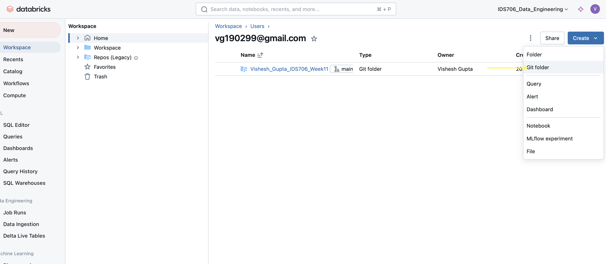

# Vishesh_Gupta_IDS706_Week11

# Databricks Setup Guide

This guide walks you through setting up a new compute cluster in Databricks and connecting an existing Git repository to your workspace.

### Setting Up a Cluster

1. **Navigate to the Compute Tab**  
   In the Databricks workspace, locate and click on the **Compute** section from the sidebar.

2. **Create a New Cluster**  
   - Click on the **New** button in the sidebar and select **Compute**.
   - You will be taken to the **Cluster Configuration** page.

3. **Configure Cluster Settings**  
   - This can be set as the general settings that have been provided to us 

4. **Start the Cluster**  
   - Click **Create** (or **Start** if the cluster already exists) to initialize the cluster.

### Connecting a Git Repository

1. **Navigate to the Workspace Tab**  
   Go to the **Workspace** section on the left sidebar.

2. **Open User Workspace**  
   - In **Workspace**, expand your user directory.
   - You should see your existing folders and repositories.

3. **Create a Git Folder**  
   - Click on the **Create** button in the top right corner and select **Git Folder**.
   - Enter the name of your repository (e.g., `Project_Repo`), url and confirm.

4. **Connect to Git**  
   - After creating the Git folder, select it, then click **Link Git** or **Set up Git integration**.
   - Follow the prompts to authenticate and select your repository from GitHub, GitLab, or another Git provider.
   - Once connected, your code files will sync to Databricks, and you can start working directly in notebooks or scripts.

### ETL Process Overview

This project implements an ETL (Extract, Transform, Load) pipeline to process football match data using Python and PySpark. The goal of the ETL process is to retrieve the raw data from an online source, perform necessary transformations, and load the processed data into Delta Lake for analysis.

### Summary of Key ETL Steps

- **Extraction**: Raw data is extracted from an external source and uploaded to DBFS.
- **Transformation**: Data cleaning, score extraction, and result classification are performed in Spark.
- **Loading**: The transformed data is stored in Delta Lake as a Delta table, making it accessible for analytical queries.

## Databricks Workflow Setup for Running Code

### Workflow Overview

The workflow consists of three main tasks that follows the summary of KEY ETL STEPS along with querying of data:
1. **Extract**
2. **Transform_and_Load**
3. **Query**

Each task is connected, with outputs from one feeding into the next.

### Dependent Libraries

To ensure the tasks run smoothly, the following libraries are specified as dependencies:
1. **pandas** - For data manipulation.
2. **databricks-sql-connector** - Allows connection to Databricks SQL.
3. **python-dotenv** - Manages environment variables.

The cluster and libraries ensure that each task has the necessary environment to execute correctly.

## Task Dependencies

Tasks are set up as independent units but are connected in sequence, with **Transform_and_Load** depending on **Extract**, and **Query** depending on **Transform_and_Load**. This sequential dependency structure ensures that each task only starts once the previous one has successfully completed as seen in the screenshot below

## References

The following resources were referenced in setting up this workflow:

- [Global Environment Variables on Databricks](https://hypercodelab.com/docs/spark/databricks-platform/global-env-variables)
- [Databricks FileStore Documentation](https://docs.databricks.com/en/dbfs/filestore.html)
- [Jeremy Tan IDS706 Week 11 Repository](https://github.com/nogibjj/Jeremy_Tan_IDS706_Week11)
- Jeremy Tans Office Hours on 11/15/2024
